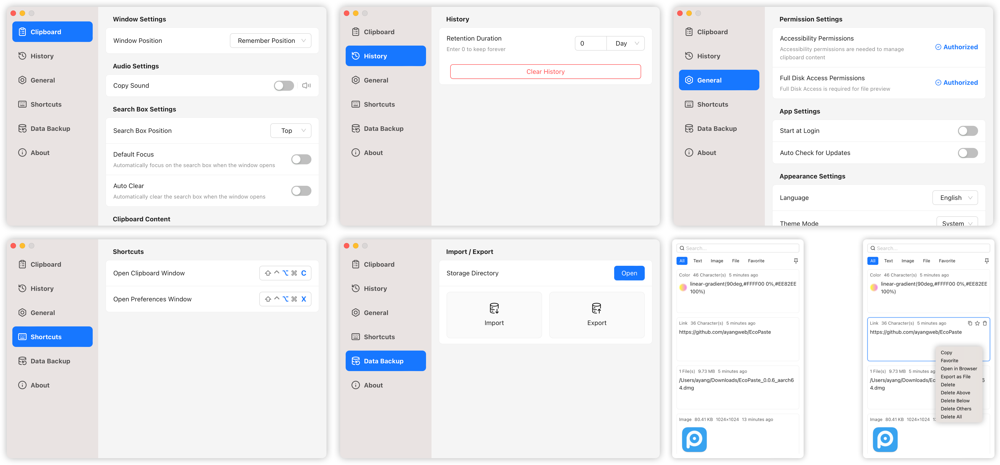

   
  
  

      English | <a href="./README.md">简体中文</a> | <a href="./README.zh-TW.md">繁體中文</a> | <a href="./README.ja-JP.md">日本語</a>
  

   
    
  

    <a href="https://github.com/EcoPasteHub/EcoPaste/releases">
      
    </a >  
    <a href="https://github.com/EcoPasteHub/EcoPaste/releases">
      
    </a >
    
  

  

    <a href="./LICENSE">
      
    </a >
    <a href="https://github.com/EcoPasteHub/EcoPaste/releases">
      
    </a >
    <a href="https://github.com/EcoPasteHub/EcoPaste/releases">
        
    </a >
  

  
   

  <picture>
    <source media="(prefers-color-scheme: dark)" srcset="./static/app-dark.en-US.png" />
    <source media="(prefers-color-scheme: light)" srcset="./static/app-light.en-US.png" />
    
 </picture>

## Download

### Windows

Manual Download: [x86](https://api.ecopaste.cn/download?platform=windows-x86) | [x64](https://api.ecopaste.cn/download?platform=windows-x64) | [ARM64](https://api.ecopaste.cn/download?platform=windows-arm)

### MacOS

Manual Download: [Apple Silicon](https://api.ecopaste.cn/download?platform=macos-arm) | [Intel](https://api.ecopaste.cn/download?platform=macos-x64)

HomeBrew: [Click here](https://ecopaste.cn/guide/install#%E4%BD%BF%E7%94%A8-homebrew-%E5%AE%89%E8%A3%85)

### Linux(x11)

Manual Download: [deb](https://api.ecopaste.cn/download?platform=linux-deb) | [AppImage](https://api.ecopaste.cn/download?platform=linux-appimage) | [rpm](https://api.ecopaste.cn/download?platform=linux-rpm)

Installation Guide: [Click here](https://ecopaste.cn/guide/install#linux)

## Features

- 🎉 Built with Tauri v2, lightweight and efficient, taking cross-platform experience to the next level.
- 💻 Compatible with Windows, macOS, and Linux (X11), enabling seamless switching between devices.
- ✨ Simple and intuitive user interface, easy to operate, zero learning curve, ready to use out of the box.
- 📋 Supports clipboard content types like plain text, rich text, HTML, images, and files.
- 🔒 Local data storage ensures user privacy and gives users full control over their data.
- 📝 Notes feature allows easy categorization, management, and retrieval to boost productivity.
- ⚙️ Rich personalization settings to meet diverse user needs and create a tailored experience.
- 🤝 Comprehensive documentation and community support to explore and grow with developers.
- 🧩 Continuously optimized with more exciting features waiting to be discovered.

## FAQ

If you encounter any issues, please refer to the [FAQ](https://ecopaste.cn/problem/macos/damage) or browse existing [Issues](https://github.com/EcoPasteHub/EcoPaste/issues). If your problem persists, feel free to submit a new issue or contact us via [Community](#Community).

## Star History

<a href="https://star-history.com/#EcoPasteHub/EcoPaste&Date">
 <picture>
   <source media="(prefers-color-scheme: dark)" srcset="https://api.star-history.com/svg?repos=EcoPasteHub/EcoPaste&type=Date&theme=dark" />
   <source media="(prefers-color-scheme: light)" srcset="https://api.star-history.com/svg?repos=EcoPasteHub/EcoPaste&type=Date" />
   
 </picture>
</a>

## Community

- WeChat

## Contributors

Thank you to everyone who has contributed to EcoPaste! If you’d like to contribute, check out the [Contributing Guide](./.github/CONTRIBUTING/en-US.md).

## Sponsors

If you find this project helpful, consider sponsoring us! Your support helps us maintain and improve EcoPaste, bringing more value to the community.

Please leave a message when sponsoring so we can include you in our [Sponsors List](https://ecopaste.cn/sponsor/list). Thank you for your support and encouragement!

|               WeChat Pay               |              Alipay              |
| :------------------------------------: | :------------------------------: |
|  |  |
