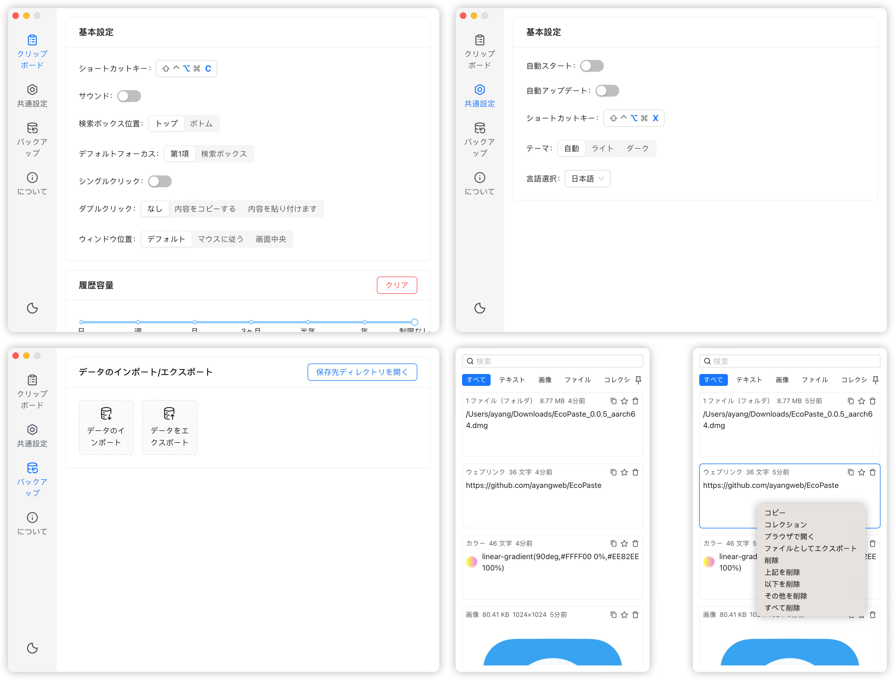
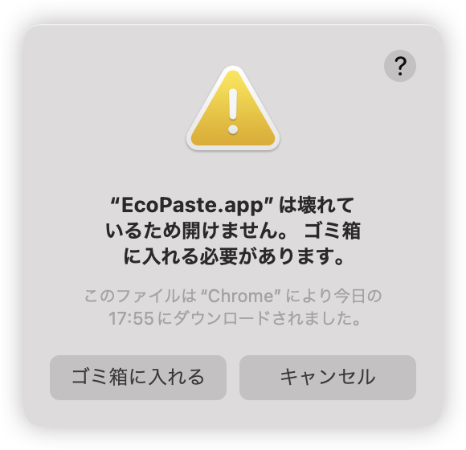

<a href="https://github.com/EcoPasteHub/EcoPaste">
  
</a>

<div align="center">
  <br/>

  <div>
      日本語 | <a href="./README.md">简体中文</a> | <a href="./README.zh-TW.md">繁體中文</a> | <a href="./README.en-US.md">English</a>
  </div>

  <br/>
    
  <a href="https://github.com/EcoPasteHub/EcoPaste/releases">
    
  </a >  
  <a href="https://github.com/EcoPasteHub/EcoPaste/releases">
    
  </a >
  <a href="https://github.com/EcoPasteHub/EcoPaste/releases">
    
  </a>

  <div>
    <a href="./LICENSE">
      
    </a >
    <a href="https://github.com/EcoPasteHub/EcoPaste/releases">
      
    </a >
    <a href="https://github.com/EcoPasteHub/EcoPaste/releases">
        
    </a >
  </div>

  <br/>

  <picture>
    <source media="(prefers-color-scheme: dark)" srcset="./images/app-dark.ja-JP.png" />
    <source media="(prefers-color-scheme: light)" srcset="./images/app-light.ja-JP.png" />
    
  </picture>
</div>

## ダウンロード

### Windows

手動インストール: [Universal](https://ecopaste-updater.ayangweb.cn/api/stable?platform=windows)

### Macos

手動インストール: [Apple Silicon](https://ecopaste-updater.ayangweb.cn/api/stable?platform=macos-arm) | [Intel](https://ecopaste-updater.ayangweb.cn/api/stable?platform=macos-x64)

HomeBrew:

1. リポジトリを追加:
```shell
brew tap EcoPasteHub/EcoPaste
```

2. インストール:
```shell
brew install ecopaste
```

3. アップデート:
```shell
brew upgrade ecopaste
```

4. アンインストール:
```shell
brew uninstall --cask ecopaste

brew untap EcoPasteHub/EcoPaste
```

### Linux(x11)

手動インストール: [AppImage](https://ecopaste-updater.ayangweb.cn/api/stable?platform=linux-appimage) | [deb](https://ecopaste-updater.ayangweb.cn/api/stable?platform=linux-deb) | [rpm](https://ecopaste-updater.ayangweb.cn/api/stable?platform=linux-rpm)

* Ubuntu、Debainシリーズ：
```shell
wget "https://ecopaste-updater.ayangweb.cn/api/stable?platform=linux-deb" -O ecopaste-stable.deb
sudo dpkg -i ecopaste-stable.deb
```

* Red Hat、CentOS、Fedoraシリーズ：
```shell
wget "https://ecopaste-updater.ayangweb.cn/api/stable?platform=linux-rpm" -O ecopaste-stable.rpm
sudo yum install ecopaste-stable.rpm
```

* Manjaro、ArchLinuxシリーズ：
```shell
yay -S eco-paste-bin
```

* 他のディストリビューション:
```shell
wget "https://ecopaste-updater.ayangweb.cn/api/stable?platform=linux-appimage" -O EcoPaste.AppImage
chmod +x EcoPaste.AppImage
./EcoPaste.AppImage --appimage-extract

sed -i 's|Exec=.*|Exec=/opt/ecopaste/EcoPaste.AppImage|g' squashfs-root/usr/share/applications/eco-paste.desktop
sed -i 's/^Icon=.*/Icon=EcoPaste/g' squashfs-root/usr/share/applications/eco-paste.desktop
install -Dm644 squashfs-root/usr/share/applications/eco-paste.desktop /usr/share/applications/EcoPaste.desktop

wget "https://raw.githubusercontent.com/EcoPasteHub/EcoPaste-Logo/refs/heads/master/img/logo.svg" -O EcoPaste.svg
install -Dm644 EcoPaste.svg /usr/share/icons/hicolor/scalable/apps/EcoPaste.svg

rm -r squashfs-root EcoPaste.svg

mkdir -p /opt/ecopaste
mv ecopaste.AppImage /opt/ecopaste/
```

## 機能の概要

- **軽量でコンパクト、多プラットフォーム対応**: 
  
  Tauriで構築されたこのアプリは、より小型で洗練され、リソースのフットプリントを最小限に抑え、Windows、MacOS、Linuxの各プラットフォームに完璧に適応し、複数のプラットフォームで一貫したユーザー体験を保証します。

- **常駐バックグラウンド、素早く起動**：

  アプリは常にバックグラウンドに常駐、カスタムショートカットキーで素早く呼び出し、クリップボードの内容をすばやく利用。
- 
  **画像OCR、オフライン認識**：

  内蔵のOCR機能、テキストとQRコードの認識をサポートし、右クリックメニューでOCR内容を素早くコピー。

  **組み込み検索**：
  内蔵検索機能、クリップボード内容をすばやく見つける、テキスト、画像（OCRテキスト検索）、ファイルを含む。

- **ローカルストレージ、データセキュリティ**：

  すべてのクリップボード内容はローカルに保存され、データプライバシーを確保。

- **もっと探検する**：

  `EcoPaste` は新機能を継続的に開発しており、より多くの可能性を共に探索することを楽しみにしています

## Q&A

<details>
<summary>1. MacOS のヒント EcoPaste.app は壊れているため開けません。</summary>

<picture>
  <source media="(prefers-color-scheme: dark)" srcset="./images/damaged-dark.ja-JP.png" />
  <source media="(prefers-color-scheme: light)" srcset="./images/damaged-light.ja-JP.png" />
  
</picture>

アプリが実行できるようにするため、`terminal` で次のコマンドを入力し、Enterキーを押してください: 

> コマンドを実行するにはパスワードが必要な場合があります。

```bash
sudo xattr -r -d com.apple.quarantine /Applications/EcoPaste.app
```

その後、アプリケーションを正常に開くことができます。

</details>

## スター歴史

<a href="https://star-history.com/#EcoPasteHub/EcoPaste&Date">
 <picture>
   <source media="(prefers-color-scheme: dark)" srcset="https://api.star-history.com/svg?repos=EcoPasteHub/EcoPaste&type=Date&theme=dark" />
   <source media="(prefers-color-scheme: light)" srcset="https://api.star-history.com/svg?repos=EcoPasteHub/EcoPaste&type=Date" />
   
 </picture>
</a>

## 貢献者

EcoPaste への貢献をいただいた皆様に感謝いたします。 

EcoPaste に貢献したい方は、[貢献ガイドライン](./.github/CONTRIBUTING/ja-JP.md)を参照してください。

<a href="https://github.com/EcoPasteHub/EcoPaste/graphs/contributors">
  
</a>
