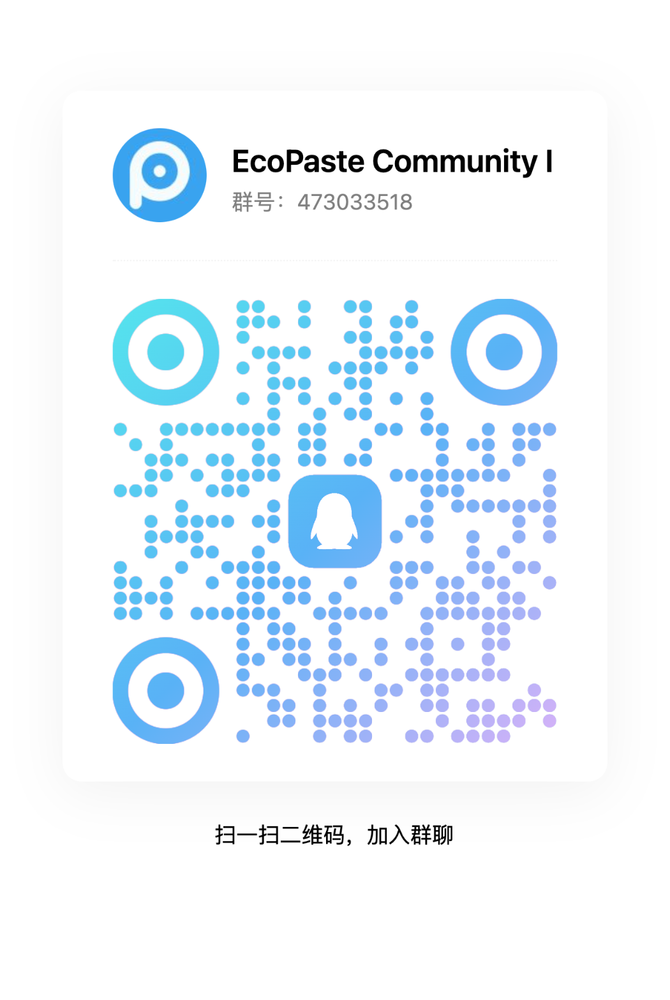

   

  

      日本語 | <a href="./README.md">简体中文</a> | <a href="./README.zh-TW.md">繁體中文</a> | <a href="./README.en-US.md">English</a>
  

   
    
  

    <a href="https://github.com/EcoPasteHub/EcoPaste/releases">
      
    </a >  
    <a href="https://github.com/EcoPasteHub/EcoPaste/releases">
      
    </a >
    
  

  

    <a href="./LICENSE">
      
    </a >
    <a href="https://github.com/EcoPasteHub/EcoPaste/releases">
      
    </a >
    <a href="https://github.com/EcoPasteHub/EcoPaste/releases">
        
    </a >
  

   

  <picture>
    <source media="(prefers-color-scheme: dark)" srcset="./static/app-dark.ja-JP.png" />
    <source media="(prefers-color-scheme: light)" srcset="./static/app-light.ja-JP.png" />
    
  </picture>

## ダウンロード

### Windows

手動ダウンロード：[x86](https://api.ecopaste.cn/download?platform=windows-x86) | [x64](https://api.ecopaste.cn/download?platform=windows-x64) | [ARM64](https://api.ecopaste.cn/download?platform=windows-arm)

### MacOS

手動ダウンロード：[Apple Silicon](https://api.ecopaste.cn/download?platform=macos-arm) | [Intel](https://api.ecopaste.cn/download?platform=macos-x64)

HomeBrew：[クリックして確認する](https://ecopaste.cn/guide/install#%E4%BD%BF%E7%94%A8-homebrew-%E5%AE%89%E8%A3%85)

### Linux(x11)

手動ダウンロード：[deb](https://api.ecopaste.cn/download?platform=linux-deb) | [AppImage](https://api.ecopaste.cn/download?platform=linux-appimage) | [rpm](https://api.ecopaste.cn/download?platform=linux-rpm)

インストールガイド：[クリックして確認する](https://ecopaste.cn/guide/install#linux)

## 機能紹介

- 🎉 Tauri v2 をもとに開発、軽量で効率的、クロスプラットフォームの体験をさらに向上させる。
- 💻 Windows、macOS、Linux（x11）とも対応でき、複数デバイス間でシームレスに切り替え可能である。
- ✨ シンプルで直感的なユーザーインターフェース、敷居が低く簡単に利用可能になる。
- 📋 テキスト、リッチテキスト、HTML、画像、ファイル形式のクリップボード内容をサポートできる。
- 🔒 データはローカルに保存され、ユーザーのプライバシーを保護、データはユーザー自身が完全に管理できる。
- 📝 メモ機能をサポートでき、簡単に分類、管理、検索が可能で作業効率を向上させる。
- ⚙️ 豊富なカスタマイズ設定で、異なるユーザーのニーズを満たす個別体験を提供できる。
- 🤝 完善なドキュメントとコミュニティ機能をサポート、開発者と共に成長を目指す。
- 🧩 継続的な最適化し、もっと驚きの機能があなたの発見を待っている。

## よくある質問

お問い合わせの前に[よくある質問](https://ecopaste.cn/problem/macos/damage)または既存の [Issues](https://github.com/EcoPasteHub/EcoPaste/issues) をご覧ください。なお不明な点がある場合、新しい Issue を提出するかまたは[コミュニティ](#コミュニティ交流)を通じてお問い合わせください。

## 履歴スター

<a href="https://star-history.com/#EcoPasteHub/EcoPaste&Date">
 <picture>
   <source media="(prefers-color-scheme: dark)" srcset="https://api.star-history.com/svg?repos=EcoPasteHub/EcoPaste&type=Date&theme=dark" />
   <source media="(prefers-color-scheme: light)" srcset="https://api.star-history.com/svg?repos=EcoPasteHub/EcoPaste&type=Date" />
   
 </picture>
</a>

## コミュニティ交流

|                                 WeChat Group                                  |                    QQ Group                     |
| :---------------------------------------------------------------------------: | :---------------------------------------------: |
|  |  |

## 貢献者

EcoPaste へ貴重なご貢献をいただいた皆様に感謝します！もし EcoPaste にご協力のご希望があれば、[貢献ガイド](./.github/CONTRIBUTING/ja-JP.md)をご覧ください。

## 寄付

このプロジェクトがお役に立てば光栄に思い、応援しいただければ助かります！貴重なご寄付を頂戴していただければ，プロジェクトの維持と発展に活用させていただい、EcoPaste はコミュニティに価値を提供し続けるようになります。

ご寄付の場合には必ずメッセージしていただき、[寄附者名簿](https://ecopaste.cn/sponsor/list)に記載させていただきます。ご支援とご協力を賜り御礼申し上げます。

|               WeChat Pay               |              Alipay              |
| :------------------------------------: | :------------------------------: |
|  |  |
