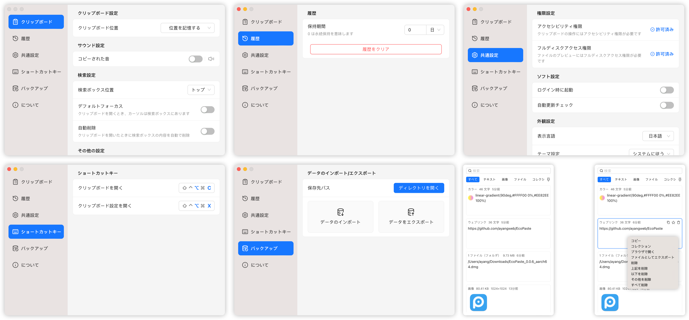

<a href="https://github.com/ayangweb/EcoPaste">
  
</a>

<div align="center">
  <br/>
  <div>
      日本語 | <a href="./README.md">English</a> | <a href="./README.zh-CN.md">简体中文</a> 
  </div>
  <br/>
    
  <a href="https://github.com/ayangweb/EcoPaste/releases/latest">
    
  </a >
  <a href="https://github.com/ayangweb/EcoPaste/releases/latest">
    
  </a >

  <div>
    <a href="https://github.com/ayangweb/EcoPaste/blob/master/LICENSE">
      
    </a >
    <a href="https://github.com/ayangweb/EcoPaste/releases/latest">
      
    </a >
    <a href="https://github.com/ayangweb/EcoPaste/releases">
        
    </a >
  </div>
</div>

## ダウンロード

- **MacOS**: [Apple Silicon](https://mirror.ghproxy.com/https://github.com/ayangweb/EcoPaste/releases/download/v0.0.4/EcoPaste_0.0.4_aarch64.dmg) | [Intel](https://mirror.ghproxy.com/https://github.com/ayangweb/EcoPaste/releases/download/v0.0.4/EcoPaste_0.0.4_x64.dmg)
- **Windows**: [Universal](https://mirror.ghproxy.com/https://github.com/ayangweb/EcoPaste/releases/download/v0.0.4/EcoPaste_0.0.4_x64_zh-CN.msi)

<picture>
  <source media="(prefers-color-scheme: dark)" srcset="./images/app-dark.ja-JP.png" />
  <source media="(prefers-color-scheme: light)" srcset="./images/app-light.ja-JP.png" />
  
</picture>

## 機能の概要

- **軽量かつクロスプラットフォーム対応**: 
  
  Tauriで構築されたこのアプリケーションは、軽量で洗練されており、リソースを最小限に抑えます。 また、WindowsとmacOSの両方で均一なユーザー体験を提供します。

- **常駐バックグラウンド、クイックウィークアップ**：

  このアプリケーションはバックグラウンドで常駐し、カスタムショートカットキーでワンクリックで起動し、時間を節約し効率を向上させます。

- **ローカルストレージ、データセキュリティ**：

  すべてのクリップボード内容は、データのプライバシーとセキュリティを確保するためにローカルに保存されます。

- **スマートグルーピング**：

  プレーンテキスト、リッチテキスト、HTML、画像、ファイルに対応。クリップボードの内容を自動的に種類ごとにグループ化し、効率的に管理します。

- **コレクション**：

  クリップボードのコンテンツをブックマークして、簡単かつ迅速にアクセスできます。仕事に重要なデータや日常生活で頻繁に使う情報を手軽に保存して取得できます。

- **組み込み検索**：

  組み込みの検索機能により、ユーザーはクリップボード上のテキスト、画像（OCRテキスト検索付き）、ファイルを素早く見つけ出すことができ、一目で簡単にアクセスできます。

- **オフライン画像 OCR**：

  数秒でテキストとQRコードを認識します。コンテキストメニューを通じて認識されたコンテンツをすばやくコピーし、オフラインでのテキスト認識を便利にします。

- **拡張コンテキストメニュー**：

  カスタマイズ可能なオプションを提供し、ユーザーが設定を自分の好みに合わせて調整し、ニーズに合った理想的なクリップボード管理ツールを作成できるようにします。

- **高度なカスタマイズ可能**：

  さまざまなシナリオや個々の好みに合わせた豊富なカスタマイズオプションを提供します。

- **自動更新**：

  自動および手動のアップデートチェックをサポートし、ユーザーが常に最新バージョンを使用して最適な体験ができるようにします。

- **バックアップと移行**：

  構成とクリップボードコンテンツのエクスポートとインポートをサポートし、異なるプラットフォームへのデータのバックアップと移行をシームレスにし、継続的なデータの可用性を保証します。

- **もっと探検する**：

  `EcoPaste` はエキサイティングな新機能で進化し続けています。より多くの可能性を共有することを楽しみにしています。

## Q&A

<details>
<summary>1. MacOSでは、"EcoPaste.app" は壊れて いるため開けません。</summary>

<picture>
  <source media="(prefers-color-scheme: dark)" srcset="./images/damaged-dark.ja-JP.png" />
  <source media="(prefers-color-scheme: light)" srcset="./images/damaged-light.ja-JP.png" />
  
</picture>

アプリが実行できるようにするため、`terminal` で次のコマンドを入力し、Enterキーを押してください: 

> コマンドを実行するにはパスワードが必要な場合があります。

```bash
sudo xattr -r -d com.apple.quarantine /Applications/EcoPaste.app
```

その後、アプリケーションを正常に開くことができます。

</details>

## スター歴史

<a href="https://star-history.com/#ayangweb/EcoPaste&Date">
 <picture>
   <source media="(prefers-color-scheme: dark)" srcset="https://api.star-history.com/svg?repos=ayangweb/EcoPaste&type=Date&theme=dark" />
   <source media="(prefers-color-scheme: light)" srcset="https://api.star-history.com/svg?repos=ayangweb/EcoPaste&type=Date" />
   
 </picture>
</a>

## 貢献者

`EcoPaste` への貢献をいただいた皆様に感謝いたします。 

このプロジェクトに貢献したい場合は、参照してください[貢献ガイド](./.github/CONTRIBUTING.ja-JP.md).

<a href="https://github.com/ayangweb/EcoPaste/graphs/contributors">
  
</a>
