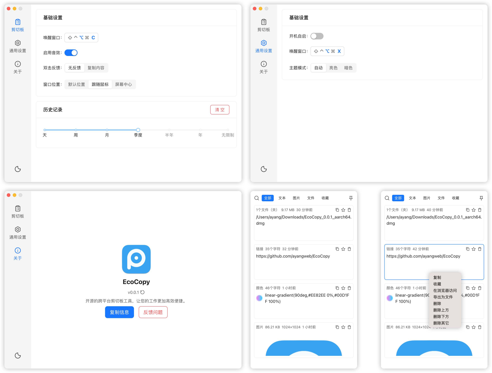
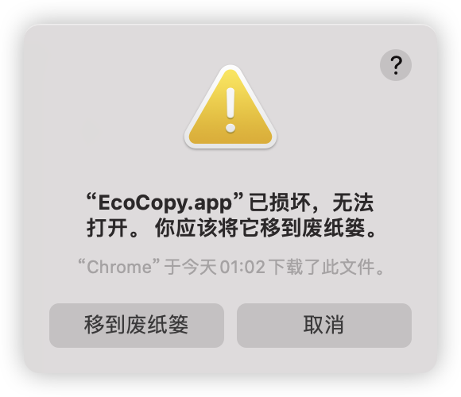

<div align="center">
  

  <div>
    <a href="https://github.com/ayangweb/EcoPaste/releases/latest">
      
    </a>
    <a href="https://github.com/ayangweb/EcoPaste/releases/latest">
      
    </a>
  </div>

  <div>
    <a href="https://github.com/ayangweb/EcoPaste/blob/master/LICENSE">
      
    </a>
    <a href="https://github.com/ayangweb/EcoPaste/releases/latest">
      
    </a>
    <a href="https://github.com/ayangweb/EcoPaste/releases">
        
    </a>
  </div>
</div>

## 下载

- **MacOS**: [Apple Silicon](https://mirror.ghproxy.com/https://github.com/ayangweb/EcoPaste/releases/download/v0.0.4/EcoPaste_0.0.4_aarch64.dmg) | [Intel](https://mirror.ghproxy.com/https://github.com/ayangweb/EcoPaste/releases/download/v0.0.4/EcoPaste_0.0.4_x64.dmg)
- **Windows**: [Universal](https://mirror.ghproxy.com/https://github.com/ayangweb/EcoPaste/releases/download/v0.0.4/EcoPaste_0.0.4_x64_zh-CN.msi)

<picture>
  <source media="(prefers-color-scheme: dark)" srcset="./images/app-dark.png" />
  <source media="(prefers-color-scheme: light)" srcset="./images/app-light.png" />
  
</picture>

## 功能介绍

- 使用 Tauri 构建项目，使其更加小巧精致，资源占用更少，同时适配多个平台。
- 应用常驻后台，通过自定义快捷键一键唤醒，节省时间，提高效率。
- 所有剪切板内容均在本地存储，确保数据隐私和安全。
- 支持纯文本、富文本、HTML、图片和文件类型。
- 根据剪切板内容类型自动进行分组，便于高效管理。
- 支持收藏剪切板内容，便于快速访问和管理重要信息。
- 内置搜索功能，轻松找到剪切板上的任何内容。
- 图片内置系统 OCR 功能，支持文本和二维码识别。
- 提供丰富的右键菜单，增强操作便捷性。
- 提供丰富的自定义选项，满足个性化需求。
- 软件支持自动更新和手动检查更新功能，确保始终保持最新版本。
- 更多的好玩的功能，有待与你一起探索...

## 常见问题

<details>
<summary>1. MacOS 提示 app 已损坏，无法打开。</summary>

<picture>
  <source media="(prefers-color-scheme: dark)" srcset="./images/injure-dark.png" />
  <source media="(prefers-color-scheme: light)" srcset="./images/injure-light.png" />
  
</picture>

在终端窗口输入以下命令，按回车键后输入系统密码并再次按回车键即可。

```bash
sudo xattr -r -d com.apple.quarantine /Applications/EcoPaste.app
```

</details>

## 参与贡献

请参考 [Contributing Guide](https://github.com/ayangweb/EcoPaste/blob/master/.github/CONTRIBUTING.md)。

## 历史星标

<a href="https://star-history.com/#ayangweb/EcoPaste&Date">
 <picture>
   <source media="(prefers-color-scheme: dark)" srcset="https://api.star-history.com/svg?repos=ayangweb/EcoPaste&type=Date&theme=dark" />
   <source media="(prefers-color-scheme: light)" srcset="https://api.star-history.com/svg?repos=ayangweb/EcoPaste&type=Date" />
   
 </picture>
</a>

## 感谢贡献者们做出的努力

<a href="https://github.com/ayangweb/EcoPaste/graphs/contributors">
  
</a>
