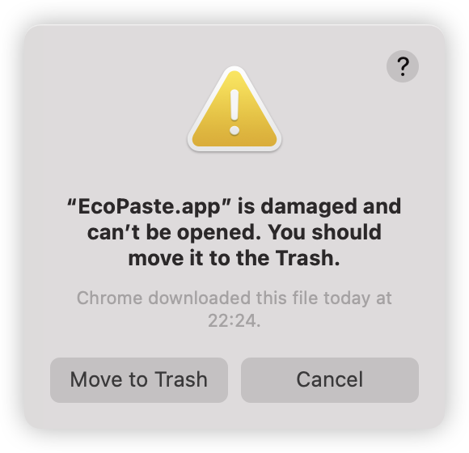

<a href="https://github.com/ayangweb/EcoPaste">
  
</a>

<div align="center">
  <br/>
  
  <div>
      English | <a href="./README.zh-CN.md">简体中文</a> | <a href="./README.zh-TW.md">繁體中文</a> | <a href="./README.ja-JP.md">日本語</a>
  </div>

  <br/>
    
  <a href="https://github.com/ayangweb/EcoPaste/releases/latest">
    
  </a >  
  <a href="https://github.com/ayangweb/EcoPaste/releases/latest">
    
  </a >
  <a href="https://github.com/ayangweb/EcoPaste/releases/latest">
    
  </a>

  <div>
    <a href="https://github.com/ayangweb/EcoPaste/blob/master/LICENSE">
      
    </a >
    <a href="https://github.com/ayangweb/EcoPaste/releases/latest">
      
    </a >
    <a href="https://github.com/ayangweb/EcoPaste/releases">
        
    </a >
  </div>
  
  <br/>

  <picture>
    <source media="(prefers-color-scheme: dark)" srcset="./images/app-dark.en-US.png" />
    <source media="(prefers-color-scheme: light)" srcset="./images/app-light.en-US.png" />
    
 </picture>
</div>

## Download

### Windows

Install Manually: [Universal](https://mirror.ghproxy.com/https://github.com/ayangweb/EcoPaste/releases/download/v0.0.6/EcoPaste_0.0.6_x64_zh-CN.msi)

Portable: [Universal](https://mirror.ghproxy.com/https://github.com/ayangweb/EcoPaste/releases/download/v0.0.6/EcoPaste_0.0.6_Windows_x64_Portable.zip)

### Macos

Install Manually: [Apple Silicon](https://mirror.ghproxy.com/https://github.com/ayangweb/EcoPaste/releases/download/v0.0.6/EcoPaste_0.0.6_aarch64.dmg) | [Intel](https://mirror.ghproxy.com/https://github.com/ayangweb/EcoPaste/releases/download/v0.0.6/EcoPaste_0.0.6_x64.dmg)

HomeBrew:

1. Add our tap:
```shell
brew tap ayangweb/EcoPaste
```

2. Install:
```shell
brew install ecopaste
```

3. Upgrade:
```shell
brew upgrade ecopaste
```

4. Uninstall:
```shell
brew uninstall --cask ecopaste

brew untap ayangweb/EcoPaste
```

### Linux

Install Manually: [AppImage](https://mirror.ghproxy.com/https://github.com/ayangweb/EcoPaste/releases/download/v0.0.6/eco-paste_0.0.6_amd64.AppImage) | [deb](https://mirror.ghproxy.com/https://github.com/ayangweb/EcoPaste/releases/download/v0.0.6/eco-paste_0.0.6_amd64.deb) | [rpm](https://mirror.ghproxy.com/https://github.com/ayangweb/EcoPaste/releases/download/v0.0.6/eco-paste-0.0.6-1.x86_64.rpm)

## Features

- **Lightweight & Cross-platform Supported**: 
  
  Built with Tauri, the application is lightweight and refined, consuming minimal resources. It also delivers a uniform user experience across both Windows, MacOS and Linux platforms.

- **Background Operation & Instant Access**：

  The application is resident in the background, wake up with one click through custom shortcut keys, save time and improve efficiency.

- **Local Storage & Data Security**：

  All clipboard content is stored locally to ensure data privacy and security.

- **Smart Grouping**：

  Supports plain text, rich text, HTML, images, and files. Automatically groups clipboard content by type, managing your clipboard content efficiently.

- **Favorites**：

  Allows you to bookmark clipboard content for easy and fast access. Whether it's crucial data for work or frequently used information in daily life, you can effortlessly save and retrieve it.

- **Built-in Search**：

  Built-in search helps users quickly find any content on the clipboard, whether it's text, images (with OCR text search), or files, making everything easily accessible at a glance.

- **Offline Image OCR**：

  Recognize text and QR codes in seconds. Quickly copy recognized content via the context menu, enabling convenient offline text recognition.

- **Enhanced Context Menu**：

  Providing rich right-click menu options, users can quickly perform various operations, which greatly improves the ease of use.

- **Highly Customizable**：

  Provide abundant customization options to meet various scenarios and individual preferences.

- **Automatic Update**：

  Supports automatic and manual update checks, ensuring users always have the latest version for the best experience.

- **Backup & Migration**：

  Supports exporting and importing configurations and clipboard content, making data backup and migration to different platforms seamless, and ensuring continuous data availability.

- **More to Explore**：

  `EcoPaste` continues to evolve with exciting new features. We look forward to sharing more possibilities with you.

## Q&A

<details>
<summary>1. "EcoPaste.app is damaged and can't be opened" on MacOS </summary>

<picture>
  <source media="(prefers-color-scheme: dark)" srcset="./images/damaged-dark.en-US.png" />
  <source media="(prefers-color-scheme: light)" srcset="./images/damaged-light.en-US.png" />
  
</picture>

Type the following command and press Enter in `terminal` to allow the app to run: 

> Password may be required to run the command.

```bash
sudo xattr -r -d com.apple.quarantine /Applications/EcoPaste.app
```

After that, you can open the app normally.

</details>

## Star History

<a href="https://star-history.com/#ayangweb/EcoPaste&Date">
 <picture>
   <source media="(prefers-color-scheme: dark)" srcset="https://api.star-history.com/svg?repos=ayangweb/EcoPaste&type=Date&theme=dark" />
   <source media="(prefers-color-scheme: light)" srcset="https://api.star-history.com/svg?repos=ayangweb/EcoPaste&type=Date" />
   
 </picture>
</a>

## Community

We recommend using [issue](https://github.com/ayangweb/EcoPaste/issues) to provide the most direct and effective feedback. Of course, the following options for feedback are also available:

- WeChat


## Contributors

Thanks to everyone who has already contributed to EcoPaste. 

If you want to contribute to EcoPaste, please refer to [Contributing Guide](./.github/CONTRIBUTING.md).

<a href="https://github.com/ayangweb/EcoPaste/graphs/contributors">
  
</a>
