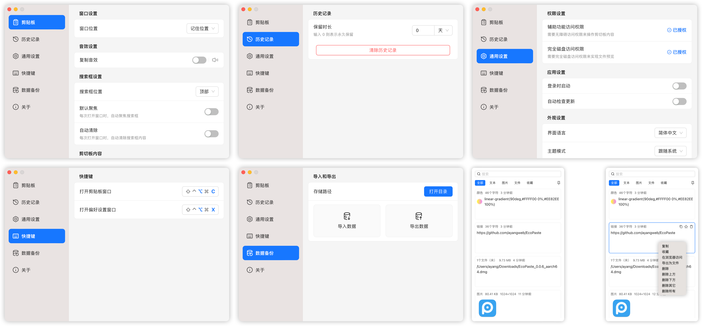
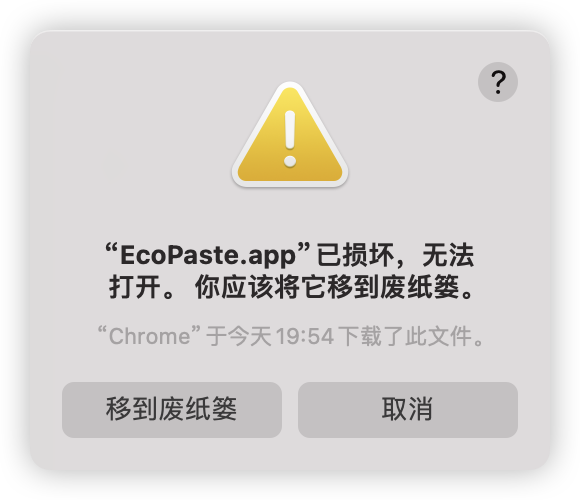

<a href="https://github.com/EcoPasteHub/EcoPaste">
  
</a>

<div align="center">
  <br/>

  <div>
      简体中文 | <a href="./README.zh-TW.md">繁體中文</a> | <a href="./README.en-US.md">English</a> | <a href="./README.ja-JP.md">日本語</a>
  </div>

  <br/>
    
  <a href="https://github.com/EcoPasteHub/EcoPaste/releases">
    
  </a >  
  <a href="https://github.com/EcoPasteHub/EcoPaste/releases">
    
  </a >
  <a href="https://github.com/EcoPasteHub/EcoPaste/releases">
    
  </a>

  <div>
    <a href="./LICENSE">
      
    </a >
    <a href="https://github.com/EcoPasteHub/EcoPaste/releases">
      
    </a >
    <a href="https://github.com/EcoPasteHub/EcoPaste/releases">
        
    </a >
  </div>

  <br/>

  <picture>
    <source media="(prefers-color-scheme: dark)" srcset="./images/app-dark.zh-CN.png" />
    <source media="(prefers-color-scheme: light)" srcset="./images/app-light.zh-CN.png" />
    
  </picture>
</div>

## 下载

### Windows

手动安装：[Universal](https://ecopaste-updater.ayangweb.cn/api/stable?platform=windows)

### Macos

手动安装：[Apple Silicon](https://ecopaste-updater.ayangweb.cn/api/stable?platform=macos-arm) | [Intel](https://ecopaste-updater.ayangweb.cn/api/stable?platform=macos-x64)

HomeBrew：

1. 添加我们的 tap:
```shell
brew tap EcoPasteHub/EcoPaste
```

2. 安装:
```shell
brew install ecopaste
```

3. 更新:
```shell
brew upgrade ecopaste
```

4. 卸载:
```shell
brew uninstall --cask ecopaste

brew untap EcoPasteHub/EcoPaste
```

### Linux(x11)

手动安装： [AppImage](https://ecopaste-updater.ayangweb.cn/api/stable?platform=linux-appimage) | [deb](https://ecopaste-updater.ayangweb.cn/api/stable?platform=linux-deb) | [rpm](https://ecopaste-updater.ayangweb.cn/api/stable?platform=linux-rpm)

* Ubuntu、Debain系列：
```shell
wget "https://ecopaste-updater.ayangweb.cn/api/stable?platform=linux-deb" -O ecopaste-stable.deb
sudo dpkg -i ecopaste-stable.deb
```

* Red Hat、CentOS、Fedora系列：
```shell
wget "https://ecopaste-updater.ayangweb.cn/api/stable?platform=linux-rpm" -O ecopaste-stable.rpm
sudo yum install ecopaste-stable.rpm
```

* Manjaro、ArchLinux系列：
```shell
yay -S eco-paste-bin
```

* 其他发行版：
```shell
wget "https://ecopaste-updater.ayangweb.cn/api/stable?platform=linux-appimage" -O EcoPaste.AppImage
chmod +x EcoPaste.AppImage
./EcoPaste.AppImage --appimage-extract

sed -i 's|Exec=.*|Exec=/opt/ecopaste/EcoPaste.AppImage|g' squashfs-root/usr/share/applications/eco-paste.desktop
sed -i 's/^Icon=.*/Icon=EcoPaste/g' squashfs-root/usr/share/applications/eco-paste.desktop
install -Dm644 squashfs-root/usr/share/applications/eco-paste.desktop /usr/share/applications/EcoPaste.desktop

wget "https://raw.githubusercontent.com/EcoPasteHub/EcoPaste-Logo/refs/heads/master/img/logo.svg" -O EcoPaste.svg
install -Dm644 EcoPaste.svg /usr/share/icons/hicolor/scalable/apps/EcoPaste.svg

rm -r squashfs-root EcoPaste.svg

mkdir -p /opt/ecopaste
mv ecopaste.AppImage /opt/ecopaste/
```

## 功能介绍

- **轻量小巧，多平台用**：
  
  使用 Tauri 构建，应用更加小巧精致，资源占用极少，同时完美适配 Windows、MacOS 和 Linux 平台，保证多平台一致的用户体验。

- **常驻后台，快捷唤醒**：

  应用常驻后台运行，通过自定义快捷键一键唤醒，帮助用户快速调用剪贴板内容，极大地提高工作效率。

- **本地存储，数据安全**：

  所有剪贴板内容均在本地存储，确保数据隐私和安全，不会有任何数据泄漏风险。

- **智能管理，类型分组**：

  支持纯文本、富文本、HTML、图片和文件类型，并自动根据剪贴板内容类型进行分组管理，方便用户高效查找和使用。

- **收藏功能，快速访问**：

  支持收藏剪贴板内容，方便快速访问和管理重要信息。无论是工作中的关键数据还是日常生活中的常用信息，都可以轻松收藏和查看。

- **内置搜索，轻松查找**：

  内置搜索功能，帮助用户快速找到任何剪贴板上的内容，无论是文本、图片（OCR文本搜索）还是文件，所有内容都可以一目了然。

- **图片OCR，离线识别**：

  内置系统 OCR 功能，支持文本和二维码识别，通过右键菜单快速复制识别到的 OCR 内容，实现离线识别，使用更便捷。

- **右键菜单，操作便捷**：

  提供丰富的右键菜单选项，用户可以快速进行各种操作，极大地提高了使用便捷性。

- **自由定制，个性体验**：

  提供详细的配置选项，用户可以自由设置和调整应用效果，打造个性化的使用体验，满足不同场景和需求。

- **自动更新，保持最新**：

  软件支持自动更新和手动检查更新功能，确保用户始终使用最新版本，享受最优质的使用体验。

- **数据备份，轻松迁移**：

  支持导出和导入配置及剪贴板内容，便于数据备份与迁移到不同平台，保证数据的持续可用性。

- **更多功能，等你探索**：

  EcoPaste 还在不断开发和添加更多有趣实用的功能，期待与你一起探索和发现这款剪贴板管理工具的更多可能性。

## 常见问题

<details>
<summary>1. MacOS 提示 EcoPaste.app 已损坏，无法打开。</summary>

<picture>
  <source media="(prefers-color-scheme: dark)" srcset="./images/damaged-dark.zh-CN.png" />
  <source media="(prefers-color-scheme: light)" srcset="./images/damaged-light.zh-CN.png" />
  
</picture>

在终端窗口输入以下命令，按回车键后输入系统密码并再次按回车键即可。

```bash
sudo xattr -r -d com.apple.quarantine /Applications/EcoPaste.app
```

</details>

## 历史星标

<a href="https://star-history.com/#EcoPasteHub/EcoPaste&Date">

 <picture>
   <source media="(prefers-color-scheme: dark)" srcset="https://api.star-history.com/svg?repos=EcoPasteHub/EcoPaste&type=Date&theme=dark" />
   <source media="(prefers-color-scheme: light)" srcset="https://api.star-history.com/svg?repos=EcoPasteHub/EcoPaste&type=Date" />
   
 </picture>
</a>

## 反馈和交流

我们推荐使用 [issue](https://github.com/EcoPasteHub/EcoPaste/issues) 提供最直接和有效的反馈。当然，也可以选择以下方式进行反馈：

- 微信


## 贡献者

感谢大家为 EcoPaste 做出的贡献。

如果你也想为 EcoPaste 做出贡献，请参考 [贡献指南](./.github/CONTRIBUTING/zh-CN.md)。

<a href="https://github.com/EcoPasteHub/EcoPaste/graphs/contributors">
  
</a>
