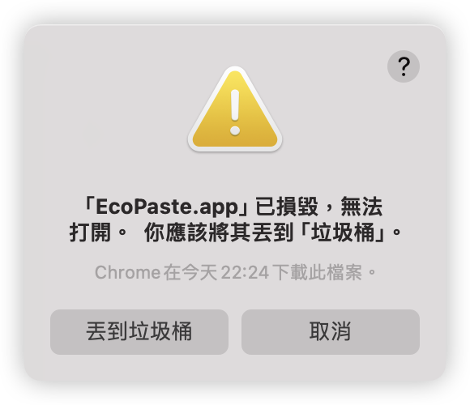

<a href="https://github.com/EcoPasteHub/EcoPaste">
  
</a>

<div align="center">
  <br/>

  <div>
    繁體中文 | <a href="./README.md">简体中文</a> | <a href="./README.en-US.md">English</a> | <a href="./README.ja-JP.md">日本語</a>
  </div>
  
  <br/>

  <a href="https://github.com/EcoPasteHub/EcoPaste/releases">
    
  </a >  
  <a href="https://github.com/EcoPasteHub/EcoPaste/releases">
    
  </a >
  <a href="https://github.com/EcoPasteHub/EcoPaste/releases">
    
  </a>

  <div>
    <a href="./LICENSE">
      
    </a >
    <a href="https://github.com/EcoPasteHub/EcoPaste/releases">
      
    </a >
    <a href="https://github.com/EcoPasteHub/EcoPaste/releases">
        
    </a >
  </div>

  <br/>

  <picture>
    <source media="(prefers-color-scheme: dark)" srcset="./images/app-dark.zh-TW.png" />
    <source media="(prefers-color-scheme: light)" srcset="./images/app-light.zh-TW.png" />
    
  </picture>
</div>

## 下載

### Windows

手動安裝：[Universal](https://ecopaste-updater.ayangweb.cn/api/stable?platform=windows)

### Macos

手動安裝：[Apple Silicon](https://ecopaste-updater.ayangweb.cn/api/stable?platform=macos-arm) | [Intel](https://ecopaste-updater.ayangweb.cn/api/stable?platform=macos-x64)

HomeBrew：

1. 添加我們的 tap:
```shell
brew tap EcoPasteHub/EcoPaste
```

2. 安裝:
```shell
brew install ecopaste
```

3. 更新:
```shell
brew upgrade ecopaste
```

4. 卸載:
```shell
brew uninstall --cask ecopaste

brew untap EcoPasteHub/EcoPaste
```

### Linux(x11)

手動安裝：[AppImage](https://ecopaste-updater.ayangweb.cn/api/stable?platform=linux-appimage) | [deb](https://ecopaste-updater.ayangweb.cn/api/stable?platform=linux-deb) | [rpm](https://ecopaste-updater.ayangweb.cn/api/stable?platform=linux-rpm)

* Ubuntu、Debain系列：
```shell
wget "https://ecopaste-updater.ayangweb.cn/api/stable?platform=linux-deb" -O ecopaste-stable.deb
sudo dpkg -i ecopaste-stable.deb
```

* Red Hat、CentOS、Fedora系列：
```shell
wget "https://ecopaste-updater.ayangweb.cn/api/stable?platform=linux-rpm" -O ecopaste-stable.rpm
sudo yum install ecopaste-stable.rpm
```

* Manjaro、ArchLinux系列：
```shell
yay -S eco-paste-bin
```

* 其他發行版：
```shell
wget "https://ecopaste-updater.ayangweb.cn/api/stable?platform=linux-appimage" -O EcoPaste.AppImage
chmod +x EcoPaste.AppImage
./EcoPaste.AppImage --appimage-extract

sed -i 's|Exec=.*|Exec=/opt/ecopaste/EcoPaste.AppImage|g' squashfs-root/usr/share/applications/eco-paste.desktop
sed -i 's/^Icon=.*/Icon=EcoPaste/g' squashfs-root/usr/share/applications/eco-paste.desktop
install -Dm644 squashfs-root/usr/share/applications/eco-paste.desktop /usr/share/applications/EcoPaste.desktop

wget "https://raw.githubusercontent.com/EcoPasteHub/EcoPaste-Logo/refs/heads/master/img/logo.svg" -O EcoPaste.svg
install -Dm644 EcoPaste.svg /usr/share/icons/hicolor/scalable/apps/EcoPaste.svg

rm -r squashfs-root EcoPaste.svg

mkdir -p /opt/ecopaste
mv ecopaste.AppImage /opt/ecopaste/
```

## 功能介紹

- **輕量小巧，多平臺用**：
  
  使用 Tauri 構建，應用更加小巧精致，資源占用極少，同時完美適配 Windows、MacOS 和 Linux 平臺，保證多平臺一致的用戶體驗。

- **常駐後臺，快捷喚醒**：

  應用常駐後臺運行，通過自定義快捷鍵一鍵喚醒，幫助用戶快速調用剪貼板內容，極大地提高工作效率。

- **本地存儲，數據安全**：

  所有剪貼板內容均在本地存儲，確保數據隱私和安全，不會有任何數據泄漏風險。

- **智能管理，類型分組**：

  支持純文本、富文本、HTML、圖片和文件類型，並自動根據剪貼板內容類型進行分組管理，方便用戶高效查找和使用。

- **收藏功能，快速訪問**：

  支持收藏剪貼板內容，方便快速訪問和管理重要信息。無論是工作中的關鍵數據還是日常生活中的常用信息，都可以輕松收藏和查看。

- **內置搜索，輕松查找**：

  內置搜索功能，幫助用戶快速找到任何剪貼板上的內容，無論是文本、圖片（OCR文本搜索）還是文件，所有內容都可以一目了然。

- **圖片OCR，離線識別**：

  內置系統 OCR 功能，支持文本和二維碼識別，通過右鍵菜單快速復製識別到的 OCR 內容，實現離線識別，使用更便捷。

- **右鍵菜單，操作便捷**：

  提供豐富的右鍵菜單選項，用戶可以快速進行各種操作，極大地提高了使用便捷性。

- **自由定製，個性體驗**：

  提供詳細的配置選項，用戶可以自由設置和調整應用效果，打造個性化的使用體驗，滿足不同場景和需求。

- **自動更新，保持最新**：

  軟件支持自動更新和手動檢查更新功能，確保用戶始終使用最新版本，享受最優質的使用體驗。

- **數據備份，輕松遷移**：

  支持導出和導入配置及剪貼板內容，便於數據備份與遷移到不同平臺，保證數據的持續可用性。

- **更多功能，等你探索**：

  EcoPaste 還在不斷開發和添加更多有趣實用的功能，期待與你一起探索和發現這款剪貼板管理工具的更多可能性。

## 常見問題

<details>
<summary>1. MacOS 提示 EcoPaste.app 已損壞，無法打開。</summary>

<picture>
  <source media="(prefers-color-scheme: dark)" srcset="./images/damaged-dark.zh-TW.png" />
  <source media="(prefers-color-scheme: light)" srcset="./images/damaged-light.zh-TW.png" />
  
</picture>

在終端窗口輸入以下命令，按回車鍵後輸入系統密碼並再次按回車鍵即可。

```bash
sudo xattr -r -d com.apple.quarantine /Applications/EcoPaste.app
```

</details>

## 歷史星標

<a href="https://star-history.com/#EcoPasteHub/EcoPaste&Date">

 <picture>
   <source media="(prefers-color-scheme: dark)" srcset="https://api.star-history.com/svg?repos=EcoPasteHub/EcoPaste&type=Date&theme=dark" />
   <source media="(prefers-color-scheme: light)" srcset="https://api.star-history.com/svg?repos=EcoPasteHub/EcoPaste&type=Date" />
   
 </picture>
</a>

## 反饋和交流

我們推薦使用 [issue](https://github.com/EcoPasteHub/EcoPaste/issues) 提供最直接和有效的反饋。當然，也可以選擇以下方式進行反饋：

- 微信


## 貢獻者

感謝大家為 EcoPaste 做出的貢獻。

如果你也想為 EcoPaste 做出貢獻，請參考 [貢獻指南](./.github/CONTRIBUTING/zh-TW.md)。

<a href="https://github.com/EcoPasteHub/EcoPaste/graphs/contributors">
  
</a>
