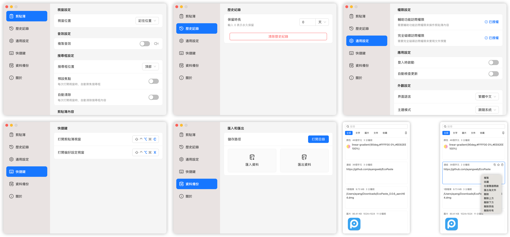

   

  

    繁體中文 | <a href="./README.md">简体中文</a> | <a href="./README.en-US.md">English</a> | <a href="./README.ja-JP.md">日本語</a>
  

  
   

  

    <a href="https://github.com/EcoPasteHub/EcoPaste/releases">
      
    </a >  
    <a href="https://github.com/EcoPasteHub/EcoPaste/releases">
      
    </a >
    
  

  

    <a href="./LICENSE">
      
    </a >
    <a href="https://github.com/EcoPasteHub/EcoPaste/releases">
      
    </a >
    <a href="https://github.com/EcoPasteHub/EcoPaste/releases">
        
    </a >
  

   

  <picture>
    <source media="(prefers-color-scheme: dark)" srcset="./static/app-dark.zh-TW.png" />
    <source media="(prefers-color-scheme: light)" srcset="./static/app-light.zh-TW.png" />
    
  </picture>

## 下載

### Windows

手動下載：[x86](https://api.ecopaste.cn/download?platform=windows-x86) | [x64](https://api.ecopaste.cn/download?platform=windows-x64) | [ARM64](https://api.ecopaste.cn/download?platform=windows-arm)

### MacOS

手動下載：[Apple Silicon](https://api.ecopaste.cn/download?platform=macos-arm) | [Intel](https://api.ecopaste.cn/download?platform=macos-x64)

HomeBrew：[點擊查看](https://ecopaste.cn/guide/install#%E4%BD%BF%E7%94%A8-homebrew-%E5%AE%89%E8%A3%85)

### Linux(x11)

手動下載：[deb](https://api.ecopaste.cn/download?platform=linux-deb) | [AppImage](https://api.ecopaste.cn/download?platform=linux-appimage) | [rpm](https://api.ecopaste.cn/download?platform=linux-rpm)

安裝指南：[點擊查看](https://ecopaste.cn/guide/install#linux)

## 功能介紹

- 🎉 基於 Tauri v2 開發，輕量高效，跨平臺體驗更進一步。
- 💻 支持 Windows、macOS 和 Linux（x11），在多設備間無縫切換。
- ✨ 簡潔直觀的使用者介面，操作簡單，零門檻上手，開箱即用。
- 📋 支持純文字、富文字、HTML、圖片和檔案類型的剪貼板內容。
- 🔒 數據本地存儲，確保用戶隱私安全，數據完全掌控在用戶手中。
- 📝 支持備註功能，輕鬆分類、管理和檢索，讓工作更高效。
- ⚙️ 豐富的個性化設定，滿足不同用戶需求，打造專屬體驗。
- 🤝 完善的檔案與社區支持，與開發者共同探索與成長。
- 🧩 持續優化中，更多驚喜功能等你發現。

## 問題迴響

1. 🔍 優先查閱[常見問題](https://ecopaste.cn/problem/macos/damage)或瀏覽已有 [issues](https://github.com/EcoPasteHub/EcoPaste/issues)。

2. ❓ 如果問題仍未解决，請提交新的 [issue](https://github.com/EcoPasteHub/EcoPaste/issues/new/choose)，並附上詳細描述，方便我們快速定位和解决。

## 歷史星標

<a href="https://star-history.com/#EcoPasteHub/EcoPaste&Date">
 <picture>
   <source media="(prefers-color-scheme: dark)" srcset="https://api.star-history.com/svg?repos=EcoPasteHub/EcoPaste&type=Date&theme=dark" />
   <source media="(prefers-color-scheme: light)" srcset="https://api.star-history.com/svg?repos=EcoPasteHub/EcoPaste&type=Date" />
   
 </picture>
</a>

## 社區交流

⚠️ 溫馨提示：群聊僅限日常討論和經驗分享，如需迴響問題或提交新需求，請查看[問題迴響](#問題迴響)。

<table>
  <thead>
    <tr>
      <th width="33.3%">微信群</th>
      <th width="33.3%">QQ 群</th>
      <th width="33.3%">Telegram</th>
    </tr>
  </thead>
  <tbody>
    <tr>
      <td>
        <picture>
          <source media="(prefers-color-scheme: dark)" srcset="https://ecopaste.cn/community/wechat-group-dark.png" />
          <source media="(prefers-color-scheme: light)" srcset="https://ecopaste.cn/community/wechat-group-light.png" />
          
        </picture>
      </td>
      <td>
        <picture>
          <source media="(prefers-color-scheme: dark)" srcset="https://ecopaste.cn/community/qq-group-dark.png" />
          <source media="(prefers-color-scheme: light)" srcset="https://ecopaste.cn/community/qq-group-light.png" />
          
        </picture>
      </td>
      <td>
        <picture>
          <source media="(prefers-color-scheme: dark)" srcset="https://ecopaste.cn/community/telegram-chat-dark.png" />
          <source media="(prefers-color-scheme: light)" srcset="https://ecopaste.cn/community/telegram-chat-light.png" />
          
        </picture>
      </td>
    </tr>
  </tbody>
</table>

## 貢獻者

感謝大家為 EcoPaste 做出的寶貴貢獻！如果你也希望為 EcoPaste 做出貢獻，請查閱[貢獻指南](./.github/CONTRIBUTING/zh-TW.md)。

## 贊助

如果您覺得這個項目對您有幫助，可以考慮贊助支持我們！您的支持將幫助我們更好地維護和發展項目，讓 EcoPaste 持續為社區創造價值。

贊助時請務必填寫留言，以便我們收錄到[贊助名單](https://ecopaste.cn/sponsor/index)中，感謝您的支持與鼓勵！

|                           微信                            |                       支付寶                        |
| :-------------------------------------------------------: | :-------------------------------------------------: |
|  |  |
